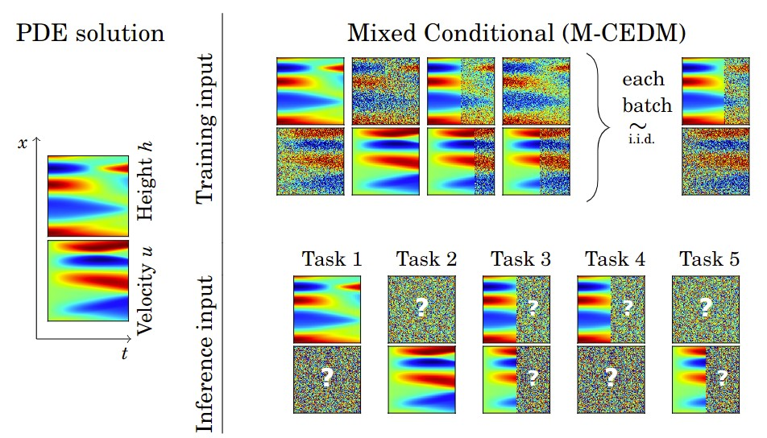
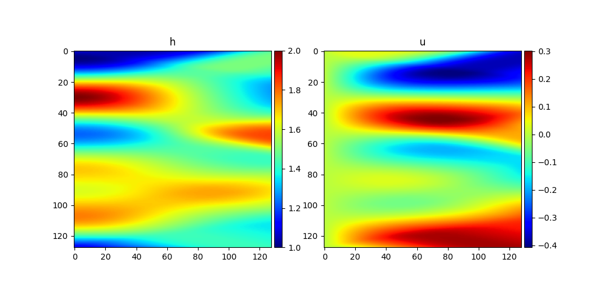
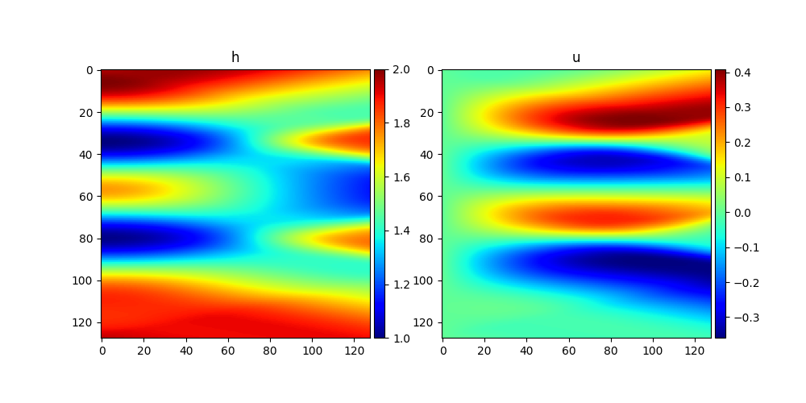
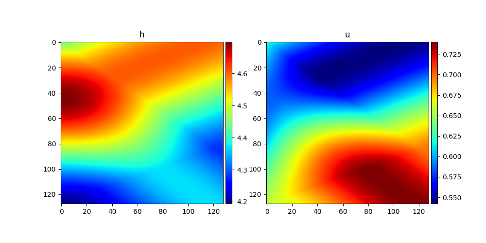
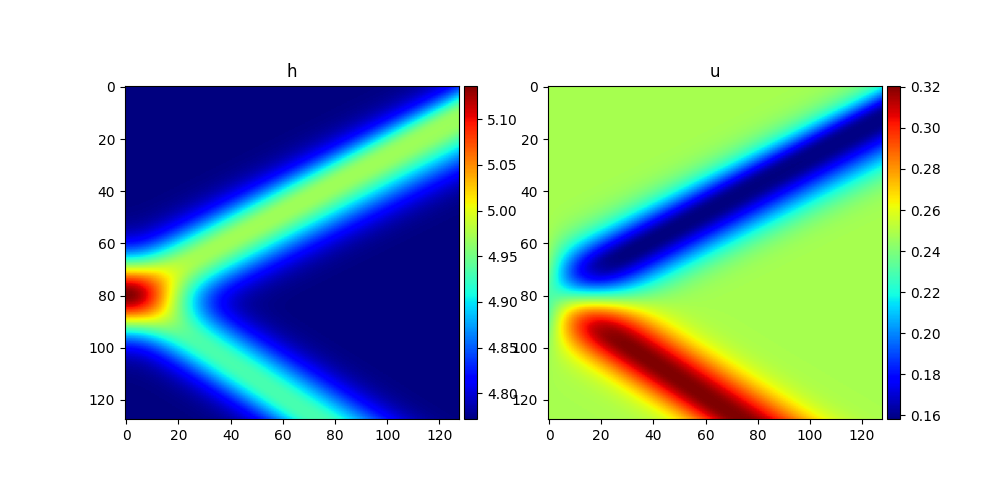

# Mixed conditional EDM 
The code repository for the paper "Diffusion models as probabilistic neural operators for recovering unobserved states of dynamical systems"

**Arxiv**: [link](https://arxiv.org/abs/2405.07097)


## Proposed method

We proposed training a single diffusion-based generative model for several tasks of interest in dynamical system modeling.
During the training we sample which states are observed and which are unobserved as well as a number of time steps available for observed states.
The model is trained to recover the unobserved states conditioned on the observed ones and tested on the tasks presented below.



## Run
In order to run the training and evaluation of the proposed method, the following command can be used:

```bash
python run.py --config-name=config_adm_edm_mcedm_res32.yaml system=swe_per subname=swe_per dataroot=data datamodule.batch_size=16 trainer.max_epochs=1 diff_sampler.n_samples=1
```

```bash
python eval_model.py --config-name=config_adm_edm_mcedm_res32.yaml system=swe_per subname=swe_per dataroot=data ckpt_path=logs/runs/run_name datamodule.batch_size=16 trainer.max_epochs=1 diff_sampler.n_samples=5 
```

## Baselines
To run baseline similar commands are used. Here are the examples of training commands. In order to run inference just run `eval_model.py` instead of `run.py` and add ckpt_path argument.

EDM training on a single task

```bash
python run.py --config-name=config_adm_edm_res32_cond_h.yaml system=swe_per subname=swe_per dataroot=data datamodule.batch_size=16 trainer.max_epochs=1 diff_sampler.n_samples=1
```

Diffusion model with U-Net from DDPM 

```bash
python run.py --config-name=config_ddim_res32_cond_h.yaml system=swe_per subname=swe_per dataroot=data datamodule.batch_size=16 trainer.max_epochs=1 diff_sampler.n_samples=1
```

Diffusion model trained to jointly approximate the states (no conditioning on training)

```bash
python run.py --config-name=config_ddim_res32.yaml system=swe_per subname=swe_per dataroot=data datamodule.batch_size=16 trainer.max_epochs=1 diff_sampler.n_samples=1
```

FNO baseline

```bash
python run.py --config-name=config_fnostatereconstrabs2d.yaml system=swe_per dataroot=data subname=swe_per datamodule.batch_size=8 trainer.max_epochs=1 model.hparams.width=32 model.hparams.inst_norm=False
```

Oformer

```bash
python run.py --config-name=config_oformer_t.yaml system=swe_per subname=swe_per dataroot=data datamodule.batch_size=1 model.hparams.lr=0.0006 trainer.max_epochs=1 trainer.gradient_clip_val=1.0 model.hparams.curriculum_steps=0
```


In order to incorporate conditioning information on inference (RePaint) change the sampler parameter 
`diff_sampler=edm_sampler diff_sampler.n_time_h=0 diff_sampler.n_time_u=64` setting how many time steps are observed for each state variable respectively.


## Data generation


The following commands can be used to generate the data for the Shallow Water Equations (SWE) equation.


1. Periodic initial conditions

```bash 
python generate/gen_swe_period_1d.py
```

or to explicitly set the generation config with hydra

```bash 
python generate/gen_swe_period_1d.py --config-path configs --config-name sw_periodic_1d
```




2. Gaussian perturbation initial conditions (or Dam Break scenario)

```bash 
python generate/gen_dam_break_1d.py
```

or 

```bash 
python generate/gen_dam_break_1d.py --config-path configs --config-name sw_perturb_1d
```

Example simulations are shown below:




The equation is solved using [PyClaw package](https://www.clawpack.org/pyclaw/started.html) that requires a separate installation. The data is saved in the `data` folder.


### Preprocessing

The generated data is preprocessed by removing the last time step in order to make inputs squared as well as by saving training set statistics for normalization of neural network inputs.
The following command can be used to replicate the preprocessing:

```bash
python preprocess_data.py --datafolder data/1D_swp_128 --datafolder_test data/1D_swp_128 --trainfile 1D_swp_128_train.h5 --testfile 1D_swp_128_test.h5 --num_steps 128 --change_num_steps
```

### Darcy flow data

The data for the Darcy flow equation is taken from [PDEBench](https://github.com/pdebench/PDEBench) data collection, file `2D_DarcyFlow_beta1.0_Train.hdf5` from [here](https://darus.uni-stuttgart.de/file.xhtml?fileId=133217&version=8.0).
and preprocessed by the following command:

```bash
python preprocess_darcy.py
```


## Citation

```
@inproceedings{haitsiukevich2024diffusion,
  title={Diffusion models as probabilistic neural operators for recovering unobserved states of dynamical systems},
  author={Haitsiukevich, Katsiaryna and Poyraz, Onur and Marttinen, Pekka and Ilin, Alexander},
  booktitle={2024 IEEE 34th International Workshop on Machine Learning for Signal Processing (MLSP)},
  year={2024},
  organization={IEEE}
}
```